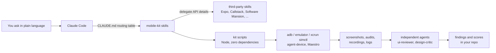

# mobile-kit

[](https://github.com/kavazvah/mobile-kit/actions/workflows/ci.yml)


A Claude Code plugin for React Native / Expo apps. It gives Claude device control, a multi-size device matrix (Android sizes, iPhones, font scale, dark mode, locales), a test strategy with scaffolding, design proposals scored by an independent critic, UI/UX audits with fixes, and motion tokens and rules. It also installs a curated set of third-party skills into your project, so every teammate gets the same setup.

<!-- Screenshot of a device-matrix report: added by the maintainer. -->

**Contents:** [Why](#why) · [Install](#install) · [What `init` does](#what-init-does) · [What you get](#what-you-get) · [Skills and modules](#skills-and-modules) · [How it works](#how-it-works) · [Daily usage](#daily-usage) · [Requirements](#requirements) · [FAQ](#faq) · [Repository layout](#repository-layout) · [Status](#status) · [Contributing](#contributing)

## Why

An AI agent writing mobile UI usually can't see what it built. It checks one phone size, in one language, and judges its own work. The result is screens that look fine on the developer's device but clip text at 360dp, break at large font sizes, or overflow in German.

mobile-kit closes that loop:

- **It looks at the app on real simulators and emulators**, across small and large phones, iPhones, 2× font scale, dark mode and every locale, with one command and a side-by-side report.
- **Code is never judged by the agent that wrote it.** UI reviews and design scores come from separate read-only agents with fixed checklists and rubrics.
- **It writes the conventions down**: spacing/type/motion tokens, a `Screen` wrapper that owns safe-area insets, test layers, and a task → skill table in your `CLAUDE.md`, so every session and every teammate works the same way.
- **It reuses the best existing skills** (Expo, Callstack, Software Mansion, Vercel, and others) instead of rewriting them, and installs them into your project at pinned versions.

## Install

```
/plugin marketplace add kavazvah/mobile-kit
/plugin install mobile-kit@kavazvah-mobile
/mobile-kit:init
```

Run the three commands inside Claude Code in your app's repository. `init` asks which modules you want; `/mobile-kit:init --yes` takes the defaults.

## What `init` does

1. **Detects** the project: Expo SDK, expo-router and its routes, app ids and URL scheme, Reanimated / Gesture Handler / Skia, locales, theme files, Jest and Maestro.
2. **Lets you choose modules** (table below).
3. **Installs the third-party skills** of those modules at project scope: skills into `.claude/skills/` (via the [`skills`](https://skills.sh) CLI, tracked in `skills-lock.json`) and plugins into `.claude/settings.json`.
4. **Writes project files**, never overwriting without asking:
   - `qa/device-matrix.json`: app ids, scheme, screens from your routes, device profiles, locales;
   - a mobile-kit section in `CLAUDE.md` (between `<!-- mobile-kit:start -->` / `<!-- mobile-kit:end -->`) with a task → skill table;
   - `.mobile-kit.json`: the lock (kit version, modules, installed externals);
   - `qa-shots/` in `.gitignore`;
   - optionally the token templates (`tokens.ts`, `Screen.tsx`).
5. **Runs the doctor** and lists what is still missing on the machine.

**Commit** `.claude/`, `skills-lock.json`, `.mobile-kit.json`, `qa/device-matrix.json` and `CLAUDE.md`. Teammates who clone the repo get the skills automatically. For each plugin external, each teammate runs `claude plugin install <plugin> --scope project` once (a committed setting enables a plugin but doesn't download it); `init` prints the exact commands.

Re-running `init` is safe: it shows a diff and applies only what you confirm. `/mobile-kit:update` adds or removes modules (`--add design`, `--remove motion`) and refreshes installed skills; `/mobile-kit:doctor` checks the machine and the project.

## What you get

What each skill leaves in your project, so you can see and commit the results:

| Ask for | Skill | You get |
|---|---|---|
| "Does it fit on small phones / in German / at large font?" | `device-matrix-qa` | `qa-shots/<run>/index.html`: a contact sheet, one row per screen and one column per profile (and locale), plus `manifest.json` and an `.audit.json` per Android shot (touch targets under 48dp, content wider than the screen) |
| "Run it on the emulator, open this link, show the logs" | `device-control` | The app built, installed and opened; screenshots, screen recordings (`.mp4` / `.mov`) and recent log lines |
| "Add tests for…" | `mobile-testing` | A Jest preset, an example component test, `.maestro/smoke.yaml`, `test` / `test:e2e` npm scripts, and CI workflow templates |
| "Review this screen / UX audit" | `ui-ux-review` | `qa/reviews/<date>-<scope>.md` with one line per finding, `[P1\|P2\|P3] screen / profile: problem → fix (file:line)`, then fixes in batches with re-checks |
| "Give me three options for…" | `design-proposals` | Variants in `src/design-lab/<feature>/`, screenshots of each on several devices, a scored comparison, and `design/decisions/<date>-<feature>.md` |
| "Make this animate smoothly" | `mobile-motion` | `motion.ts` tokens + `useMotion()`, code that follows the motion rules, and recordings of the result |

## Skills and modules

mobile-kit's own skills always ship with the plugin. A module that is off only means its third-party skills aren't installed and its rows are left out of the `CLAUDE.md` routing table.

| Skill | What it does |
|---|---|
| `device-control` | Build, install, launch, deep-link, logs, screenshots and screen recordings on iOS simulators and Android emulators |
| `device-matrix-qa` | Reshapes one Android emulator into many screen sizes and drives several iPhones; screenshots every screen per profile and locale with a contact-sheet report |
| `mobile-testing` | What to test at which layer; scaffolds Jest + React Native Testing Library + Maestro; CI templates |
| `ui-ux-review` | Audits screens (independent `ui-reviewer` agent + a static scan for raw spacing/colours), writes prioritized findings, fixes them in small batches |
| `design-proposals` | 2–3 code variants of a screen in a dev-only Design Lab, rendered on devices and scored by the independent `design-critic` agent |
| `mobile-motion` | Motion tokens (`duration`, `spring`, `useMotion()` with reduced motion), rules, release-build review with recordings |
| `init`, `doctor`, `update` | User-invoked setup and maintenance |

| Module | Default | Third-party skills it installs | Source | License |
|---|---|---|---|---|
| core | always | Expo official plugin (`expo@claude-plugins-official`) | [expo/skills](https://github.com/expo/skills) | MIT |
| | | `vercel-react-native-skills` | [vercel-labs/agent-skills](https://github.com/vercel-labs/agent-skills) | MIT |
| devices | on | `agent-device`, `dogfood`, `android-emulator`, `ios-simulator` | [callstack/agent-device](https://github.com/callstack/agent-device) | MIT |
| matrix | on | (uses devices) | | |
| testing | on | `react-native-testing` | [callstack/react-native-testing-library](https://github.com/callstack/react-native-testing-library) | MIT |
| | | `github-actions` | [callstackincubator/agent-skills](https://github.com/callstackincubator/agent-skills) | MIT |
| ui-ux | on | `ios-design-guidelines`, `android-design-guidelines` | [ehmo/platform-design-skills](https://github.com/ehmo/platform-design-skills) | MIT |
| motion | on | `react-native-best-practices` (Software Mansion) | [software-mansion-labs/skills](https://github.com/software-mansion-labs/skills) | MIT |
| | | `animate-expo` | [emilkowalski/skills](https://github.com/emilkowalski/skills) | MIT |
| design | off | `mobile-design` | [RubenGlez/mobile-design](https://github.com/RubenGlez/mobile-design) | MIT |
| perf | off | Callstack `building-react-native-apps` plugin (incl. `react-native-best-practices`) | [callstackincubator/agent-skills](https://github.com/callstackincubator/agent-skills) | MIT |
| motion-skia | off | `reanimated-skia-performance` | [andreev-danila/skills](https://github.com/andreev-danila/skills) | **none declared**: `init` asks before installing |
| haptics | off | `pulsar-haptics` | [software-mansion-labs/skills](https://github.com/software-mansion-labs/skills) | MIT |

The full, verified list with purposes is in [`external-skills.json`](external-skills.json). Thanks to the authors of these skills: Expo, Vercel, Callstack, Software Mansion, Emil Kowalski, Ruben Glez (RubenGlez), Rasty Turek (ehmo) and andreev-danila.

## How it works



- **Skills** are Markdown instructions Claude loads when your request matches them. They say what to do, in which order, and which script to run.
- **Scripts** (`scripts/`, Node ≥ 18, no dependencies) do the deterministic work: detect the project, install externals, write config, drive devices, scan code. Each has `--help`, most have `--dry-run` and `--json`.
- **Agents** (`agents/`) only have read access (`Read`, `Glob`, `Grep`). They see the screenshots and the code, and return findings or scores in a fixed format.
- **One Android emulator becomes many phones**: profiles change the emulator's size and density at runtime (`adb shell wm size` / `wm density`), plus font scale, dark mode and navigation mode, and everything is reset afterwards. iOS uses one simulator per device, created as `QA <name>`.

## Daily usage

Ask in plain language; the routing table in your `CLAUDE.md` points Claude to the right skill.

1. "Does the settings screen fit on small Android phones?"
2. "Run the matrix for every screen in English and German before the release."
3. "Boot an iPhone simulator, install the release build and open myapp://profile."
4. "The app crashes on launch on the emulator, get me the logs."
5. "Add an E2E test for login and run it."
6. "The paddings look inconsistent, review the profile screen and fix what you find."
7. "Give me three layout options for the onboarding screen."
8. "Make the card expand smoothly when tapped, and record it on the emulator."

## Requirements

| | Needed for |
|---|---|
| Node.js ≥ 18, git | everything (the kit's scripts have no dependencies) |
| Android SDK: `adb`, `emulator`, at least one AVD; JDK 17 for local builds | Android device control and the matrix |
| macOS with Xcode (iOS simulators, `xcrun simctl`) | everything iOS |
| [`agent-device`](https://github.com/callstack/agent-device) CLI (`npm i -g agent-device@latest`) | optional: tapping/typing in the app, exploratory QA |
| [Maestro](https://maestro.dev) | optional: E2E flows |
| About 10 GB free disk | local native builds (`doctor` warns when space is low) |

Expo SDK 52 or newer is supported. Run `/mobile-kit:doctor` to check a machine.

## FAQ

**Does it work with bare React Native?** Partly. Bare projects are detected and get a warning. Layout rules, testing and UI review work; device builds and the Design Lab (which needs expo-router) may need manual steps. Full bare-RN support isn't in v1.

**Windows?** The scripts are cross-platform, and Android works where the Android SDK runs. iOS needs macOS. CI and the test suite run on Linux and macOS.

**Why aren't the third-party skills copied into this repo?** They belong to their authors and keep improving. mobile-kit references them by source, installs them into *your* project, and records exact hashes in `skills-lock.json`, so you get updates when you choose (`/mobile-kit:update`) and can always see where each skill came from.

**How do I update?** Update the plugin with `claude plugin update mobile-kit@kavazvah-mobile` (or `/plugin`), then run `/mobile-kit:update` in each project. It refreshes the third-party skills and re-renders the `CLAUDE.md` section for the new kit version.

**Does the Design Lab ship to users?** No. It renders only in dev builds, or in builds made with `EXPO_PUBLIC_DESIGN_LAB=1` for iOS matrix runs. Never set that variable for a store build.

## Repository layout

```
.claude-plugin/        plugin.json and marketplace.json
skills/                one folder per skill (SKILL.md + references/ + assets/ + scripts/)
agents/                ui-reviewer.md, design-critic.md (read-only)
scripts/               detect, install-externals, scaffold, doctor, device, design-lab, scan-hardcoded
scripts/lib/           shared helpers, including devices.mjs (the adb/simctl backend)
shared/                layout rules, review checklist, CLAUDE.md section, tokens/Screen/motion templates
external-skills.json   verified list of third-party skills per module
evals/                 skill-triggering eval cases for `claude plugin eval`
test/                  node:test suite, fixture projects, fake adb/xcrun
docs/SPEC.md           the full specification
```

## Status

Version **0.1.0**, the first release.

- Verified on a fresh Expo SDK 57 app (macOS, Android API 36 emulator, iOS simulators): `init` end to end, the device matrix with locales, Jest + RNTL 14, a Maestro smoke flow on a release build, the Design Lab in Expo Go, and screen recordings. All 19 skill-triggering evals pass.
- Not yet tried on a real production project, and not yet checked: the Design Lab in an iOS release build, and the review agents on a real audit. Reports and pull requests are very welcome.

## Contributing

Issues and pull requests are welcome. Before opening a PR:

```bash
npm test                      # node --test, no install needed
npm run validate              # claude plugin validate --strict (needs the claude CLI)
```

Skill-triggering evals live in [`evals/`](evals) and run with `claude plugin eval .` (they call the model, so they use your plan or API key). CI runs the tests and the validation on every push; evals run on demand.

## License

[MIT](LICENSE) © 2026 Vahid Kavazovic. Third-party skills keep their own licenses (table above).
